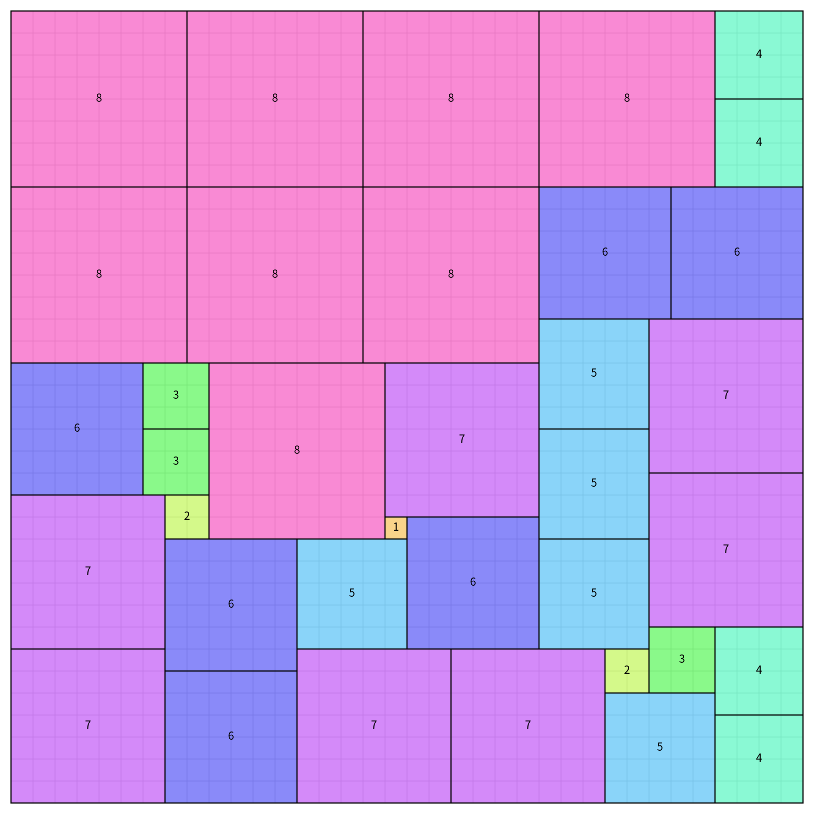
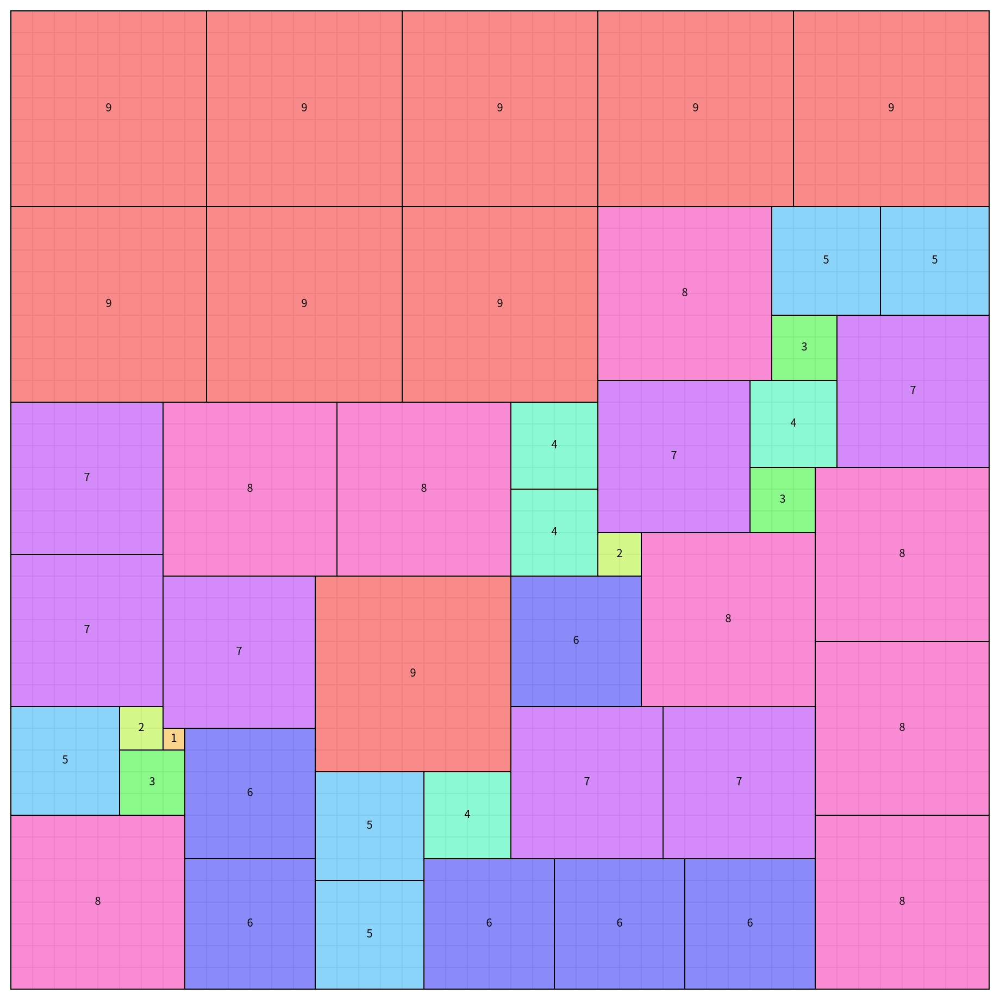

# 正方形密鋪問題

## 問題概述

本專案解決一個數學密鋪問題：

給定數字 `n`，希望將以下的數字方塊**完全填滿**一個正方形：

- `1 × 1` 共 `1` 塊
- `2 × 2` 共 `2` 塊
- `3 × 3` 共 `3` 塊
- ... 直到 `n × n` 共 `n` 塊

這些方塊的總面積符合數學公式：

$$
1^3 + 2^3 + ... + n^3 = \left(\frac{n(n+1)}{2}\right)^2
$$

這代表這些方塊的總面積能剛好填滿一個邊長為 `n(n+1)/2` 的正方形，但如何擺放才能不留空隙或重疊，則是一個組合最佳化問題。

## 挑戰與解法

### 數學背景

- 由於 `1^3 + 2^3 + ... + n^3` 的總和形成一個**完全平方數**，因此理論上存在可能的填充方式。
- 例如當 `n = 9` 時：
 
$$
1^3 + 2^3 + ... + 9^3 = \left(\frac{9 \times 10}{2}\right)^2 = 45^2 = 2025
$$
  
需要 `45` 塊不同大小的正方形來填滿 `45 × 45` 棋盤。

### 主要挑戰

- **無重疊與無空隙**：方塊必須剛好填滿棋盤。
- **組合最佳化**：此問題屬於 NP-hard 類別，暴力窮舉計算時間過長。
- **最佳擺放順序**：不同擺放順序可能導致找解的時間不同。

### 求解策略

本專案使用 **回溯 + 剪枝** 來搜尋所有可能的密鋪解法，並應用以下最佳化策略：

1. **回溯 + 剪枝**  
   - 每次嘗試放置方塊時，若發現無法滿足條件，則立即回溯，避免無效計算。

2. **大方塊優先策略**  
   - 先放入大方塊（如 `n × n`），再放小方塊，有助於減少搜尋空間。

3. **啟發式搜尋**  
   - 每次選擇下一個要填的空格時，優先選擇**靠左上角**的空位，以維持有序排列。

## 輸出格式

### JSON 格式

每組解會輸出 `solution_X.json`，格式如下：

```json
{
  "solutionIndex": 1,
  "boardSize": 45,
  "placements": [
    {"id": 1, "size": 9, "row": 0, "col": 0},
    {"id": 2, "size": 6, "row": 0, "col": 9},
    {"id": 3, "size": 6, "row": 9, "col": 0}
  ]
}
```

- `boardSize`：最終正方形的邊長。
- `placements`：記錄每個方塊的 `size`（邊長）、`row` 和 `col`（左上角座標）。

### SVG 圖檔

- 每個 `solution_X.svg` 顯示對應的拼圖解。
- 背景有淡灰色的格線，方便對齊觀察。
- 每個方塊用不同顏色填充（半透明），並在中心標註方塊大小。

## 執行時間

在 AMD Ryzen 9 5950X 執行

`n = 8`:

- `15.76` 秒第一組解
- 一小時找到 `3427` 組解
- `15666.72` 秒找到全部 `18656` 組解

`n = 9`:
- `1666.04` 秒第一組解
- 一小時找到 `19` 組解
- 十小時找到 `2704` 組解




